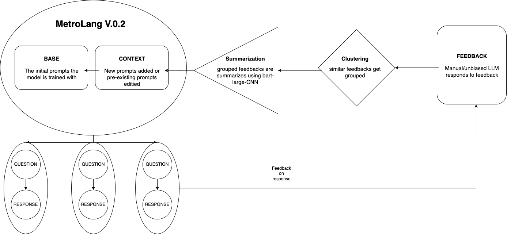
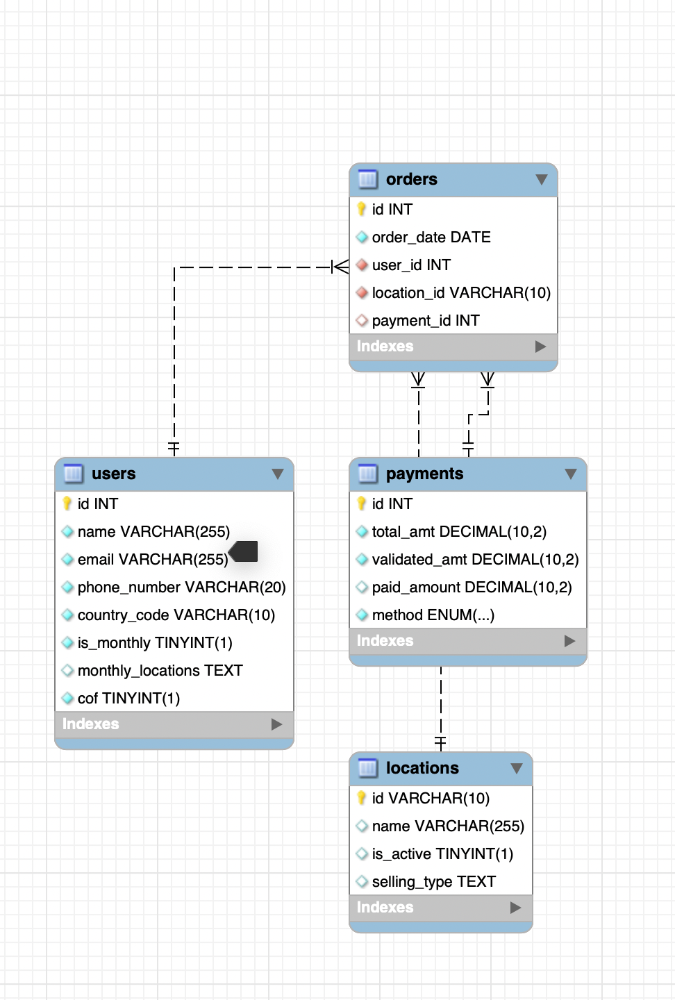

# MetroLang

 <https://metrolang.streamlit.app/>
MetroLang is a Text to SQL application that uses Local(Llama) or Cloud(Gemini) APIs.

## Demo

## Flow

    1. Model has a base Prompt that describes the following MySQl DataBase

    2. User can ask questions and will be returned a SQL query accordingly

    3. User can give Feedback(positive or negative). Negative feedback require userf to fill in what went wrong

    4. Admin can look at the feedback and add/edit prompts accordingly

    5. Admin can choose to summarize the feedbacks for reducing efforts and removing similar feedbacks

## Features

### FeedBack Loop

    1. Posititive Feedbacks can be given to estimate user satisfaction
    2. Negative Feedbacks can be given with what went wrong and an Correct SQL Query(Optional)

### Feedback Summarization

    1. Feedbacks are grouped using HDSCAN clustering algorithm 
    2. These grouped feedbacks are fed to bart-large-cnn for summarization
    3. These Summaries are used to take action by Admin(Data team) user

### Chat History

    Users have a chat history for their asked questions. They can read and give feedback on previous chats

### Model Selection

    Either a local LLM (llama3.2:3b) or cloud LLM (gemini-2.0-pro-exp) can be chosen to run the Application

### User Roles

    Admin and Guest user have different privileges

    Guest users can:-
        1. ask questions
        2. read their chat history
    
    Admins can:- 
        1. Read all feedbacks
        2. Summarize all feedbacks
        3. edit/add to the base prompt.
        + Guest privileges
